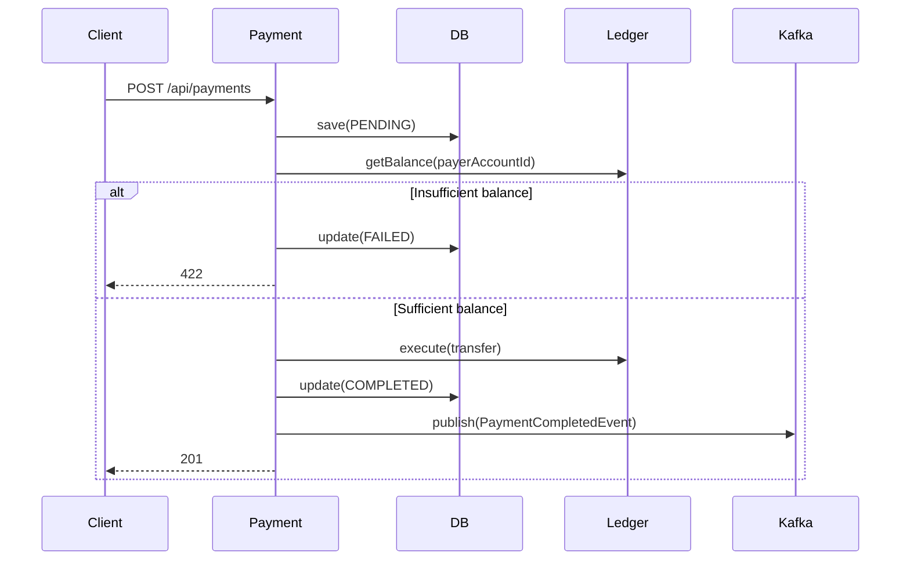

# Payment Service

A Spring Boot microservice that accepts payment requests, validates balances via an external Ledger service, executes transfers, and publishes events to Kafka.

---

## Table of Contents

- [Architecture](#architecture)
- [Tech Stack](#tech-stack)
- [Project Structure](#project-structure)
- [Getting Started](#getting-started)
- [Configuration](#configuration)
- [API Reference](#api-reference)
- [Payment Flow](#payment-flow)
- [Design Decisions](#design-decisions)
- [Running Tests](#running-tests)
- [Local Infrastructure](#local-infrastructure)

---

## Architecture

```
Client → Payment Service → Ledger Service (HTTP)
                        → PostgreSQL / In-Memory DB
                        → Kafka (payment.events)
```



---

## Tech Stack

| Concern | Choice |
|---|---|
| Framework | Spring Boot 3.2.5 |
| Language | Java 17 |
| Build | Maven |
| HTTP client | Spring `RestClient` |
| Messaging | Spring Kafka |
| Persistence | In-memory (`ConcurrentHashMap`) — swap-ready for jOOQ + PostgreSQL |
| Testing | JUnit 5, Mockito, MockMvc, MockRestServiceServer, EmbeddedKafka |
| Local infra | Docker Compose (Kafka, WireMock ledger stub, Kafka UI) |

---

## Project Structure

```
src/main/java/com/example/payment/
├── PaymentServiceApplication.java
├── config/
│   └── KafkaTopicConfig.java          # Declares payment.events topic
├── controller/
│   └── PaymentController.java         # POST /api/payments, GET /api/payments, GET /api/payments/{id}
├── exception/
│   ├── GlobalExceptionHandler.java    # Maps domain exceptions → HTTP status codes
│   └── InsufficientBalanceException.java
├── kafka/
│   ├── PaymentEventPublisher.java     # Interface
│   ├── KafkaPaymentEventPublisher.java
│   └── PaymentCompletedEvent.java     # Event record published on success
├── ledger/
│   ├── LedgerClient.java              # Interface + response DTOs
│   ├── HttpLedgerClient.java          # RestClient implementation with timeouts
│   ├── LedgerException.java
│   └── InvalidAccountException.java
├── model/
│   └── Payment.java                   # Domain entity (thread-safe mutable state)
├── repository/
│   ├── PaymentRepository.java         # Interface
│   ├── InMemoryPaymentRepository.java # Thread-safe in-memory implementation
│   └── PaymentFilter.java             # Query filter value object
└── service/
    ├── PaymentService.java            # Orchestrates the full payment flow
    └── CreatePaymentResult.java       # Wraps payment + isReplay flag
```

---

## Getting Started

### Prerequisites

- Java 17+
- Maven 3.8+
- Docker (for local infrastructure)

### 1. Start infrastructure

```bash
docker compose up -d
```

This starts:
- **Kafka** on `localhost:9092`
- **WireMock** (Ledger stub) on `localhost:8081`
- **Kafka UI** at [http://localhost:8090](http://localhost:8090)

### 2. Run the service

```bash
./mvnw spring-boot:run
```

The service starts on **http://localhost:8080**.

### 3. Create a payment

```bash
curl -X POST http://localhost:8080/api/payments \
  -H "Content-Type: application/json" \
  -H "Idempotency-Key: a1b2c3d4-e5f6-7890-abcd-ef1234567890" \
  -d '{
    "payerAccountId": "550e8400-e29b-41d4-a716-446655440000",
    "payeeAccountId": "7c9e6679-7425-40de-944b-e07fc1f90ae7",
    "amount": 150.00,
    "currency": "AED",
    "description": "Rent payment"
  }'
```

---

## Configuration

All configuration lives in `src/main/resources/application.properties`.

| Property | Default | Description |
|---|---|---|
| `server.port` | `8080` | HTTP port |
| `ledger.base-url` | `http://localhost:8081` | Ledger service URL |
| `ledger.connect-timeout-ms` | `2000` | Ledger HTTP connect timeout |
| `ledger.read-timeout-ms` | `5000` | Ledger HTTP read timeout |
| `spring.kafka.bootstrap-servers` | `localhost:9092` | Kafka broker |
| `kafka.topic.payment-events` | `payment.events` | Topic for completed payment events |
| `spring.kafka.producer.acks` | `all` | Require all in-sync replicas to acknowledge |
| `spring.kafka.producer.retries` | `5` | Retry transient producer errors |
| `spring.kafka.producer.properties.enable.idempotence` | `true` | Prevent duplicate Kafka messages on retry |

---

## API Reference

### POST /api/payments

Creates a new payment.

**Headers**

| Header | Required | Description |
|---|---|---|
| `Content-Type` | Yes | `application/json` |
| `Idempotency-Key` | No | Arbitrary string. Duplicate requests with the same key return the original payment instead of creating a new one. |

**Request body**

```json
{
  "payerAccountId": "550e8400-e29b-41d4-a716-446655440000",
  "payeeAccountId": "7c9e6679-7425-40de-944b-e07fc1f90ae7",
  "amount": 150.00,
  "currency": "AED",
  "description": "Rent payment"
}
```

| Field | Type | Required | Validation |
|---|---|---|---|
| `payerAccountId` | UUID | Yes | |
| `payeeAccountId` | UUID | Yes | |
| `amount` | Decimal | Yes | > 0.00 |
| `currency` | String | Yes | Non-blank |
| `description` | String | No | |

**Responses**

| Status | Condition |
|---|---|
| `201 Created` | Payment created. `Location` header points to the new resource. |
| `200 OK` | Idempotent replay — same `Idempotency-Key` was already processed. |
| `400 Bad Request` | Validation error (missing/invalid fields). |
| `422 Unprocessable Entity` | Insufficient balance or invalid account. |
| `502 Bad Gateway` | Ledger service error or unreachable. |

**Example response (201)**

```json
{
  "id": "f47ac10b-58cc-4372-a567-0e02b2c3d479",
  "payerAccountId": "550e8400-e29b-41d4-a716-446655440000",
  "payeeAccountId": "7c9e6679-7425-40de-944b-e07fc1f90ae7",
  "amount": 150.00,
  "currency": "AED",
  "description": "Rent payment",
  "status": "COMPLETED",
  "createdAt": "2026-04-06T08:00:00Z",
  "updatedAt": "2026-04-06T08:00:01Z"
}
```

---

### GET /api/payments

List payments with optional filtering. All query parameters are optional and combinable. Returns an empty array when nothing matches.

```
GET /api/payments
GET /api/payments?payerAccountId={uuid}
GET /api/payments?payeeAccountId={uuid}
GET /api/payments?status=COMPLETED
GET /api/payments?payerAccountId={uuid}&status=FAILED
```

**Query parameters**

| Parameter | Type | Description |
|---|---|---|
| `payerAccountId` | UUID | Filter by payer account |
| `payeeAccountId` | UUID | Filter by payee account |
| `status` | `PENDING` \| `COMPLETED` \| `FAILED` | Filter by payment status |

**Response** — `200 OK`, array ordered newest-first.

```json
[
  {
    "id": "f47ac10b-58cc-4372-a567-0e02b2c3d479",
    "payerAccountId": "550e8400-e29b-41d4-a716-446655440000",
    "payeeAccountId": "7c9e6679-7425-40de-944b-e07fc1f90ae7",
    "amount": 150.00,
    "currency": "AED",
    "description": "Rent payment",
    "status": "COMPLETED",
    "createdAt": "2026-04-06T08:00:00Z",
    "updatedAt": "2026-04-06T08:00:01Z"
  }
]
```

---

### GET /api/payments/{id}

Fetch a single payment by its ID.

**Responses**

| Status | Condition |
|---|---|
| `200 OK` | Payment found. |
| `404 Not Found` | No payment with this ID. |

**Example**

```bash
curl http://localhost:8080/api/payments/f47ac10b-58cc-4372-a567-0e02b2c3d479
```

---

## Payment Flow

1. **Idempotency check** — if an `Idempotency-Key` header is present and was already seen, the existing payment is returned immediately (no side effects).
2. **Persist PENDING** — the payment is saved to the repository before any external calls.
3. **Balance check** — `GET /api/ledger/accounts/{id}/balance` is called on the Ledger service.
4. **Insufficient funds** — if the balance is too low the payment is updated to `FAILED` and `422` is returned.
5. **Execute transfer** — `POST /api/ledger/transfers` is called on the Ledger service.
6. **Persist COMPLETED** — the payment is updated in the repository.
7. **Publish event** — a `PaymentCompletedEvent` is published to the `payment.events` Kafka topic (async, fire-and-forget; failures are logged but not fatal to the HTTP response).

Any unexpected exception from steps 3–6 marks the payment as `FAILED` before re-throwing.

---

## Design Decisions

### Repository abstraction
`PaymentRepository` is an interface. The current `InMemoryPaymentRepository` uses `ConcurrentHashMap` with no external dependencies. To switch to PostgreSQL + jOOQ, implement the interface and register the new bean — no service or controller changes required.

### Ledger abstraction
`LedgerClient` is an interface. `HttpLedgerClient` is the production implementation. Tests inject a Mockito mock directly. The class has two constructors: a Spring-wired production constructor (`@Autowired`) and a package-private test constructor that accepts a `RestTemplate` for `MockRestServiceServer` interception.

### Kafka abstraction
`PaymentEventPublisher` is an interface backed by `KafkaPaymentEventPublisher`. The producer is configured with `acks=all` and `enable.idempotence=true` for at-least-once delivery without duplicates. The `paymentId` is used as the Kafka partition key for ordering guarantees per payment.

### Idempotency
Clients may supply an `Idempotency-Key` header (any string). The key is stored with the payment and indexed in a secondary map. Duplicate requests short-circuit at step 1 and return `200 OK` with the original payment — safe to retry on network failures.

### Thread safety
- `Payment.status` and `Payment.updatedAt` are mutated together; both their writer (`updateStatus`) and readers (`getStatus`, `getUpdatedAt`) are `synchronized` on the instance to prevent torn reads.
- `InMemoryPaymentRepository.save()` and `findByIdempotencyKey()` are `synchronized` on the repository instance to keep the two-map write atomic — preventing a reader from observing an idempotency key registered before its corresponding payment entry is visible.

---

## Running Tests

```bash
# All tests
./mvnw test

# Unit tests only (no Kafka broker needed)
./mvnw test -Dgroups="!integration"
```

| Test class | Type | What it covers |
|---|---|---|
| `PaymentServiceTest` | Unit | Full service flow, idempotency, all failure paths |
| `PaymentControllerTest` | `@WebMvcTest` slice | All HTTP status codes, request validation, list filters |
| `HttpLedgerClientTest` | Unit | All Ledger HTTP error mappings via `MockRestServiceServer` |
| `InMemoryPaymentRepositoryTest` | Unit | All filter combinations, idempotency key index |
| `KafkaPaymentEventPublisherIT` | Integration (`@EmbeddedKafka`) | Event lands on topic with correct key and payload |

---

## Local Infrastructure

`docker-compose.yml` provides everything needed to run the service locally without a real Ledger or Kafka deployment.

| Service | Port | Purpose |
|---|---|---|
| Kafka | `9092` | Message broker |
| Zookeeper | `2181` | Kafka coordination |
| Kafka UI | `8090` | Browse topics and messages at http://localhost:8090 |
| WireMock (Ledger stub) | `8081` | Stub Ledger service — stubs defined in `wiremock/mappings/ledger.json` |

**Default WireMock stubs:**
- `GET /api/ledger/accounts/*/balance` → `200` with balance `1200.00 AED`
- `POST /api/ledger/transfers` → `200` with `transferId: txn-stub-001`

To simulate a failure, add a new mapping to `wiremock/mappings/ledger.json` or use the WireMock admin API at `http://localhost:8081/__admin`.
